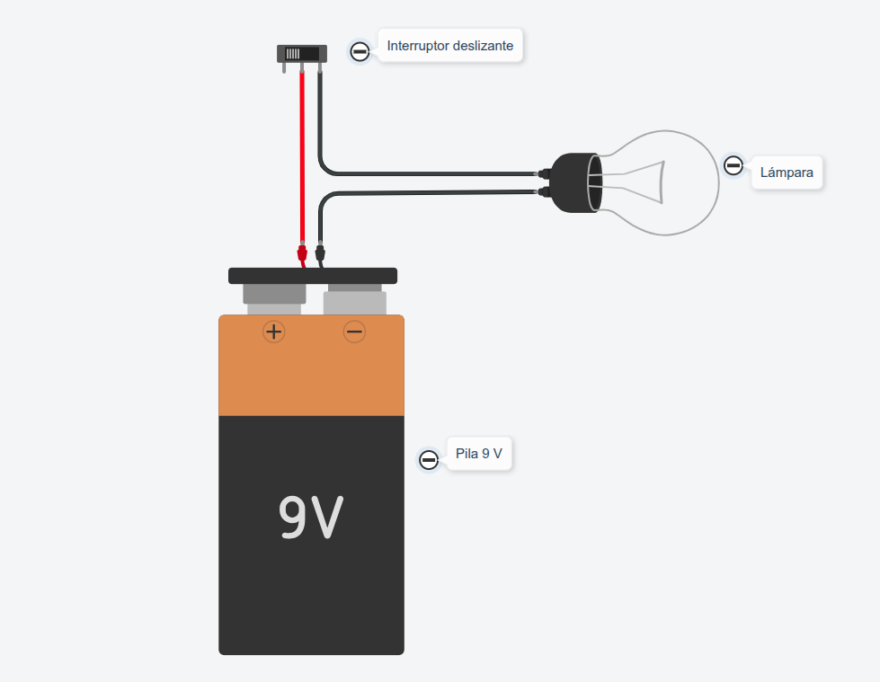

### Prácticas de Electricidad con TinkerCad
----

> **Práctica 1 · Encendido de una bombilla mediante interruptor**

Entra en TinkerCad con tu código de clase y usuario, monta el siguiente circuito y comprueba su funcionamiento.

> **Actividades**

1. Abre un documento en [**Google Drive**](https://drive.google.com/) con tu cuenta corporativa **@g.educaand.es** y llámalo **Prácticas de electricidad**.
2. Escribe el título de esta práctica y pega una captura de pantalla del circuito que has montado en TinkerCad.

***Contesta a las siguientes preguntas***

1. ¿Qué ocurre con la bombilla cuando se cierra el interruptor?
2. Cambia la pila por una de 1,5 voltios, explica que ocurre con el brillo de la bombilla al darle al interruptor.

> **Documentación a entregar**

Al terminar todas las prácticas, envía el enlace del documento a la tarea de [**Moodle Centros**](https://educacionadistancia.juntadeandalucia.es/centros/sevilla/login/index.php) que tienes asignada.

