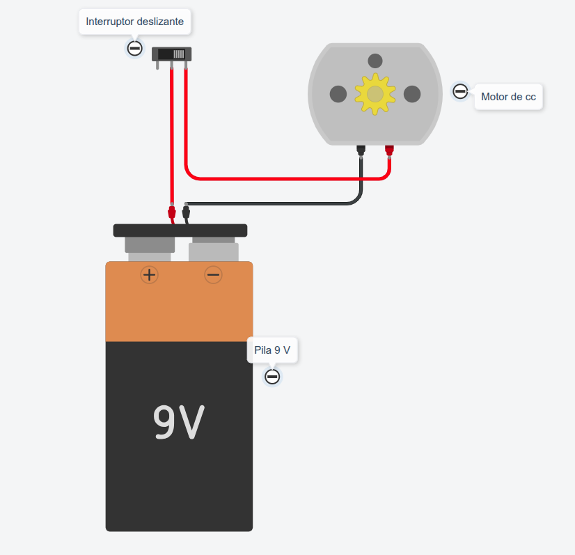

### Prácticas de Electricidad con TinkerCad
----

> **Práctica 2 · Encendido de un motor mediante interruptor**

Entra en TinkerCad con tu código de clase y usuario, monta el siguiente circuito y comprueba su funcionamiento.

> **Actividades**

1. Abre el documento **Prácticas de electricidad** de tu cuenta [**Google Drive**](https://drive.google.com/).
2. Añade el título de esta práctica y pega una captura de pantalla del circuito que has montado en TinkerCad.

***Contesta a las siguientes preguntas***

1. ¿Qué ocurre con el motor cuando se cierra el interruptor?
2. Cambia la pila por una de 3 voltios, explica que ocurre con el giro del motor al darle al interruptor.
3. Cambia los cables, conectando negro-rojo, y explica que ocurre con el giro del motor.

> **Documentación a entregar**

Al terminar todas las prácticas, envía el enlace del documento a la tarea de [**Moodle Centros**](https://educacionadistancia.juntadeandalucia.es/centros/sevilla/login/index.php) que tienes asignada.

