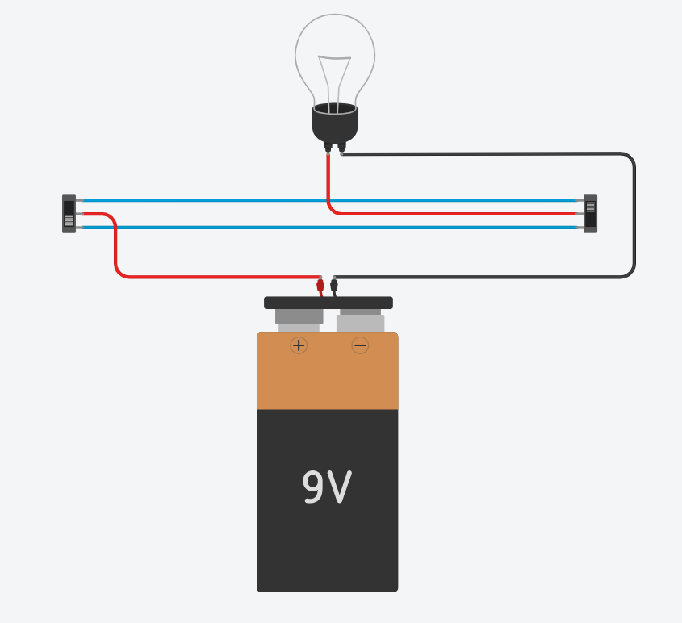

### Prácticas de Electricidad con TinkerCad
----

> **Práctica 4 · Punto de luz conmutado**

Entra en TinkerCad con tu código de clase y usuario, monta el siguiente circuito y comprueba su funcionamiento.

> **Actividades**

1. Abre el documento **Prácticas de electricidad** de tu cuenta [**Google Drive**](https://drive.google.com/).
2. Añade el título de esta práctica y pega una captura de pantalla del circuito que has montado en TinkerCad.

***Contesta a las siguientes preguntas***

1. Explica porque es posible encender y/o apagar la bombilla desde ambos conmutadores.
2. ¿Dónde se suelen montar este tipo de circuitos?.

> **Documentación a entregar**

Al terminar todas las prácticas, envía el enlace del documento a la tarea de [**Moodle Centros**](https://educacionadistancia.juntadeandalucia.es/centros/sevilla/login/index.php) que tienes asignada.

