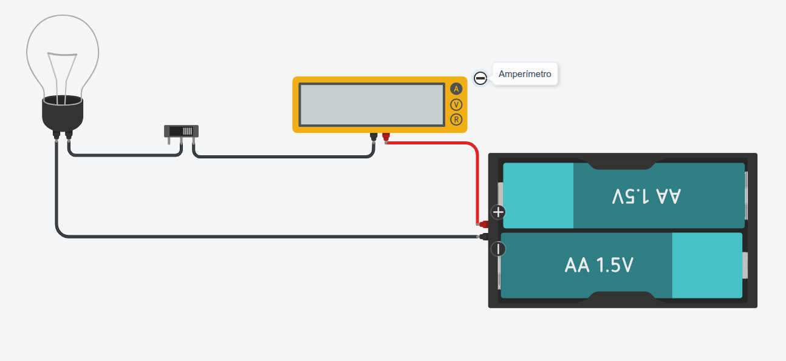

### Prácticas de Electricidad con TinkerCad
----

> **Práctica 5 · Medida de intnsidad con amperímetro**

Entra en TinkerCad con tu código de clase y usuario, monta el siguiente circuito y comprueba su funcionamiento.

> **Actividades**

1. Abre el documento **Prácticas de electricidad** de tu cuenta [**Google Drive**](https://drive.google.com/).
2. Añade el título de esta práctica y pega una captura de pantalla del circuito que has montado en TinkerCad.

***Paso a paso***

1. Inicia simulación y dale al interruptor para que se encienda la bombilla.
2. Anota el valor que marca el amperímetro
3. Cambia el circuito y ponle sólo una pila de 1.5 voltios
4. Anota el valor que marca el amperímetro para este caso.
5. El valor del amperímetro es ¿mayor o menor que en el primer caso? Explica que ha ocurrido.

> **Documentación a entregar**

Al terminar todas las prácticas, envía el enlace del documento a la tarea de [**Moodle Centros**](https://educacionadistancia.juntadeandalucia.es/centros/sevilla/login/index.php) que tienes asignada.

