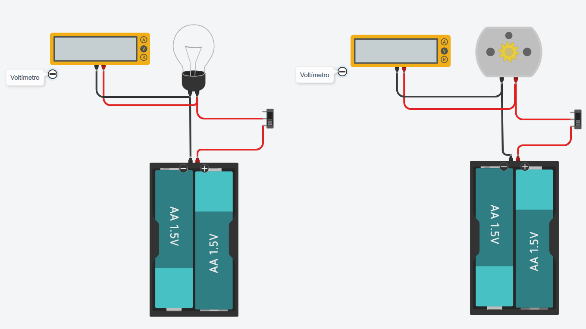

### Prácticas de Electricidad con TinkerCad
----

> **Práctica 6 · Medida de voltaje con voltímetro**

Entra en TinkerCad con tu código de clase y usuario, monta los siguientes circuitos y comprueba su funcionamiento.

> **Actividades**

1. Abre el documento **Prácticas de electricidad** de tu cuenta [**Google Drive**](https://drive.google.com/).
2. Añade el título de esta práctica y pega una captura de pantalla del circuito que has montado en TinkerCad.

> **Paso a paso**

1. Inicia simulación y dale a los interruptores para que funcionen bombilla y motor.
2. Anota el valor que marca el voltímetro en ambos casos.
3. Cambia uno de los circuitos y ponle una pila de 9 voltios.
4. ¿Que valor marca ahora el voltímetro?.

> **Documentación a entregar**

Al terminar todas las prácticas, envía el enlace del documento a la tarea de [**Moodle Centros**](https://educacionadistancia.juntadeandalucia.es/centros/sevilla/login/index.php) que tienes asignada.

